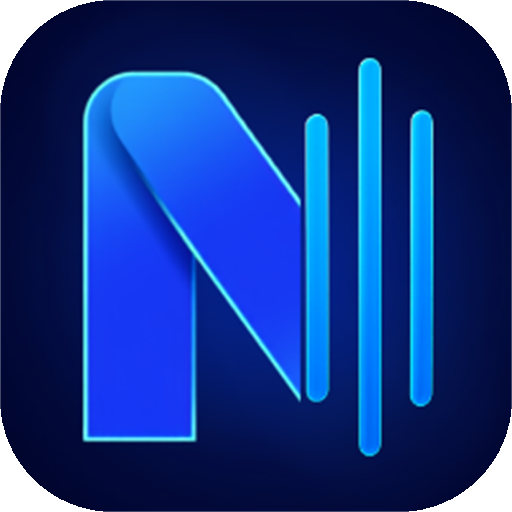

<p align="center">
  
</p>

<h1 align="center">NeoFy</h1>

<p align="center">
  Un cliente de Spotify ligero y nativo para Windows y Linux.<br>
  <b>~150 MB</b> de memoria — o <b>menos de 100</b> en modo rendimiento — frente a los
  400-700 MB del cliente oficial.
</p>

---

> **Aviso.** NeoFy no está afiliado ni patrocinado por Spotify AB. Es un proyecto
> independiente que usa la Web API pública de Spotify. **Necesita una cuenta Spotify
> Premium**: es la propia API la que lo exige para controlar la reproducción.

## Qué es

Spotify no permite que una app de terceros reproduzca audio por su API oficial: solo lo
permite con un SDK que exige un navegador embebido, que es justo el peso que NeoFy existe
para evitar. De ahí que se parta en dos mitades:

- **El audio** lo lleva [`librespot`](https://github.com/librespot-org/librespot), que
  implementa el protocolo abierto de Spotify Connect y convierte el equipo en un dispositivo
  llamado `NeoFy`.
- **Todo lo demás** —biblioteca, búsqueda, playlists y el control de la reproducción— va por
  la Web API oficial con OAuth PKCE, apuntando a ese dispositivo.

Un efecto secundario aprovechado: como el control va por la Web API, **un Stream Deck que
use la API de Spotify controla NeoFy sin plugin ninguno**.

## Funciones

- Biblioteca, playlists, búsqueda y cola, con scroll infinito.
- Portada con tu historial reciente, lo que más escuchas y tus artistas.
- Botón de "me gusta" en cada canción.
- Crear y quitar playlists.
- **Teclas multimedia globales**: el botón de play/pausa de unos cascos funciona aunque
  NeoFy esté en la bandeja. Barra espaciadora dentro de la app.
- **En Linux, integración con el escritorio por MPRIS**: NeoFy sale en el widget de
  reproducción de KDE y GNOME con carátula, y `playerctl` lo controla sin plugin.
- **Modo rendimiento**: sustituye las carátulas por mosaicos de color generados y baja el
  consumo por debajo de 100 MB, sin tocar el audio.
- Bandeja del sistema: cerrar la ventana no corta la música.
- **Se actualiza sola** (Windows): comprueba las releases de GitHub y se actualiza en un clic
  desde Ajustes, sin perder la sesión ni la configuración. En Linux avisa y lo actualiza
  pacman, que es a quien le corresponde.

## Instalación

### Windows

Descarga el instalador de la sección [Releases](../../releases). Trae los tres binarios
dentro (interfaz, audio y metadatos), no pide permisos de administrador y ocupa 14 MB.

### Linux

Cada release trae un instalador nativo por familia de distribución. Los tres instalan lo
mismo: el programa en `/opt/neofy`, el lanzador en el menú de aplicaciones y el comando
`neofy` en el `PATH`.

| Distribución | Cómo |
|---|---|
| **Arch**, Manjaro, EndeavourOS | `yay -S neofy-bin` |
| **Debian**, Ubuntu, Mint, Pop!_OS | `sudo apt install ./neofy_x.y.z_amd64.deb` |
| **Fedora**, RHEL | `sudo dnf install ./neofy-x.y.z-1.x86_64.rpm` |
| **openSUSE** | `sudo zypper install ./neofy-x.y.z-1.x86_64.rpm` |

Los `.deb` y `.rpm` se descargan de [Releases](../../releases); el de Arch se compila solo.

> **En GNOME** hace falta además la extensión de AppIndicator para que aparezca el icono de
> la bandeja. Sin ella NeoFy funciona igual, pero el botón de cerrar cierra del todo en vez
> de esconderse — que es justo lo que debe hacer si no hay bandeja a la que volver.

### Configuración inicial (una sola vez)

Spotify solo deja que una app de terceros funcione para los usuarios que su creador da de
alta a mano — **25 como máximo** —, así que NeoFy no puede traer una configurada: necesitas
crear la tuya. Es gratis: **en Windows el instalador te lo pide en una casilla y en Linux te
lo pide la propia app al abrirla**, así que no hay que editar ningún fichero a mano.

1. Entra en [developer.spotify.com/dashboard](https://developer.spotify.com/dashboard) y
   crea una app. Marca **Web API**.
2. En **Redirect URI** pon exactamente esto:
   ```
   http://127.0.0.1:8898/callback
   ```
   Ojo: Spotify ya no acepta `localhost`, solo el `127.0.0.1` literal, y sin barra final.
3. Copia el **Client ID** y pégalo donde te lo pida: la casilla del instalador en Windows, o
   la pantalla de primeros pasos de la app en Linux (y también en Windows si lo dejaste en
   blanco o compilaste desde el código).

Para instalaciones desatendidas en Windows:
`NeoFy-x.y.z-windows-x64.exe /SILENT /CLIENTID=tu-id`.

> **La primera vez se abrirá el navegador dos veces y es correcto.** Son dos flujos OAuth
> distintos: el de la Web API y el de librespot, que usa el client_id del cliente de
> escritorio de Spotify y no puede compartir token. Los dos quedan cacheados.

## Limitaciones conocidas

Vienen del Modo Desarrollo de la API de Spotify, no del código:

| Limitación | Detalle |
|---|---|
| Cuenta **Premium** obligatoria | La API la exige para todo el control de reproducción. |
| Playlists ajenas | La Web API devuelve 403 al leer sus canciones. NeoFy las lee por librespot con un sidecar; se pueden reproducir enteras igualmente. |
| Búsqueda capada a 10 resultados | Se pagina con "ver más". |
| Sin Daily Mix ni Radar de novedades | Spotify no expone por API las listas que genera para cada usuario. |
| Cuota diaria | Si se agota, la API responde 429 durante unas horas. NeoFy lo detecta, deja de insistir y te dice a qué hora vuelve. |

## Compilar desde el código

```powershell
# Windows
powershell -ExecutionPolicy Bypass -File tool\build_librespot.ps1   # sidecars, 1ª vez
flutter build windows --release
powershell -ExecutionPolicy Bypass -File tool\build_installer.ps1   # + Inno Setup 6
```

```bash
# Linux
./tool/build_sidecars.sh        # sidecars, 1ª vez (Rust, pkg-config, libpulse, openssl)
flutter build linux --release
./tool/build_linux_bundle.sh    # deja dist/NeoFy-x.y.z-linux-x86_64.tar.gz
```

```bash
flutter analyze
flutter test
```

La arquitectura y las trampas de la API están documentadas en
[`ARQUITECTURA.md`](ARQUITECTURA.md) — incluidos varios endpoints que cambiaron de nombre y cuyo
comportamiento real está verificado con las sondas de `tool/`.

## Licencia

MIT. Ver [LICENSE](LICENSE), que incluye además los avisos de terceros.
